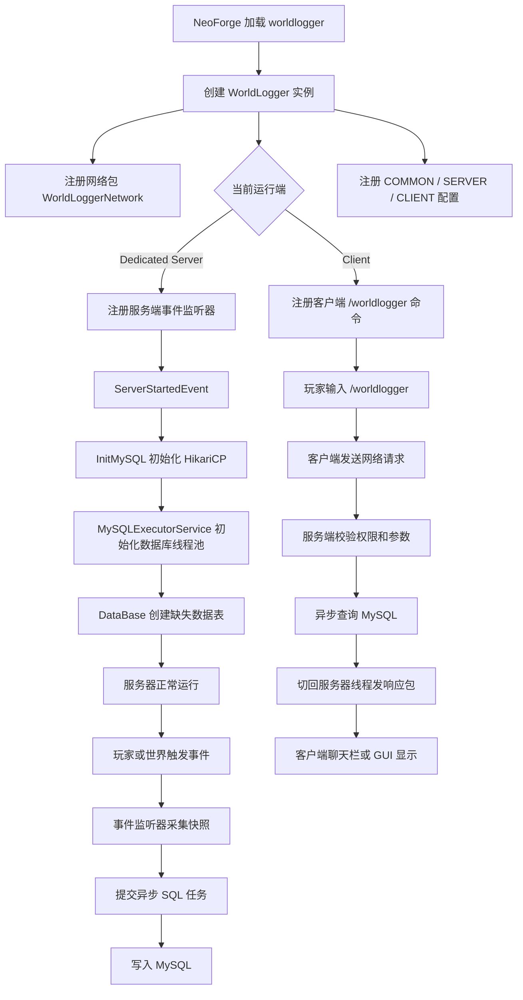
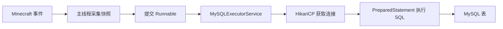
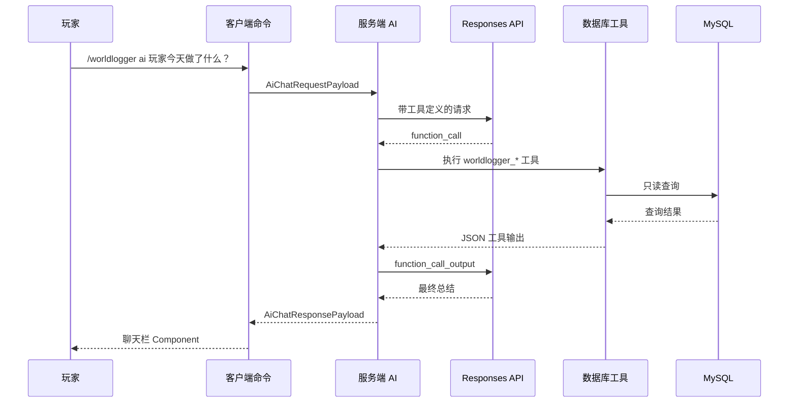
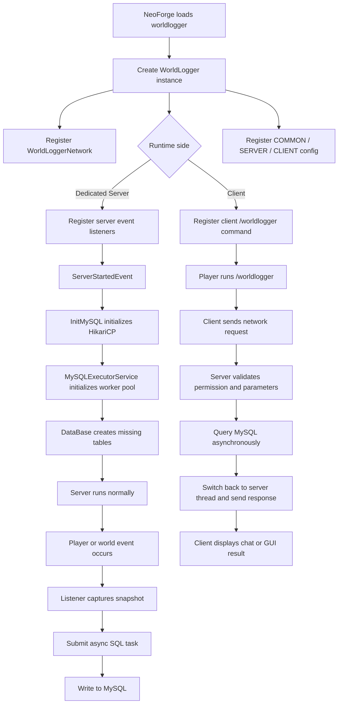
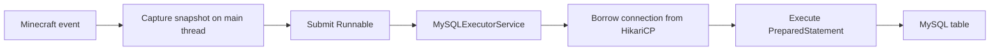
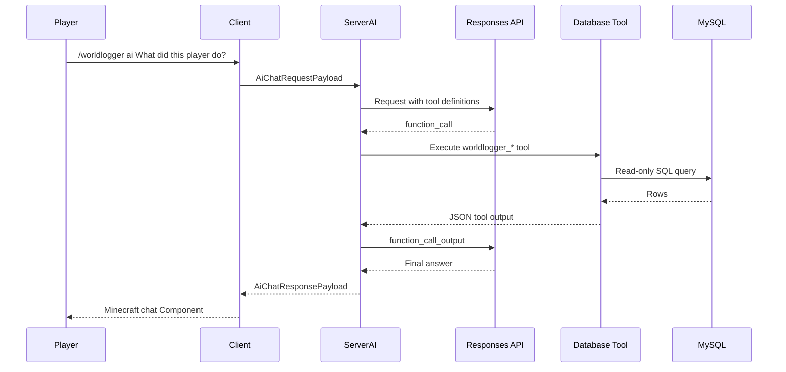

# WorldLogger

> A NeoForge mod that records important Minecraft world events into MySQL, then lets admins inspect them through commands, an in-game GUI, and an AI database assistant.

**Language Switch**

README previews cannot run JavaScript, so this document uses native Markdown/HTML collapsible sections. Open the language you want to read and collapse the other one.

<details open>
<summary><strong>中文文档</strong></summary>

## 项目简介

WorldLogger 是一个面向 Minecraft NeoForge `26.1.2.73` 的服务端日志模组。它把玩家登录、退出、死亡、丢物、经验变化、聊天、命令、容器交互、方块放置/破坏、爆炸、实体死亡和实体生成等事件记录到 MySQL 数据库中，并提供三种查看方式：

- 聊天栏命令：`/worldlogger select` 和 `/worldlogger search`
- 图形界面：`/worldlogger gui`
- AI 助手：`/worldlogger ai ...`

这个项目的核心目标不是简单打印日志，而是把 Minecraft 世界里的“发生了什么”变成可查询、可回放、可分析的数据。对于期末演示，可以把它解释成：服务器像一个观察员，监听游戏世界的关键事件，把事件整理成数据库记录，再通过命令、GUI 和 AI 帮管理员理解这些记录。

## 项目定位

这个模组主要面向专用服务器，也就是 `Dedicated Server`。在专用服务器环境中，模组会注册事件监听器、初始化 MySQL、创建数据表并异步写入日志。客户端环境主要负责注册 `/worldlogger` 命令、打开 GUI、发送网络请求和显示服务器返回的数据。

单人游戏里的客户端 AI 可以聊天，但没有数据库工具。原因是客户端不应该直接访问服务器数据库，单人客户端模式也没有服务端数据库记录链路。

## 基本信息

| 项目项 | 内容 |
|---|---|
| Mod ID | `worldlogger` |
| Mod 名称 | `WorldLogger` |
| 当前版本 | `1.1.3` |
| Minecraft 版本 | `26.1.2` |
| NeoForge 版本 | `26.1.2.73` |
| Java Toolchain | Java 25 |
| 数据库 | MySQL |
| 数据库连接池 | HikariCP `6.2.1` |
| JDBC 驱动 | MySQL Connector/J `9.6.0` |
| 构建工具 | Gradle + `net.neoforged.moddev` |
| 许可证 | MIT |
| 作者 | `create_xiaoyu` |

## 给没有接触过 NeoForge 的同学看的解释

Minecraft 原版只负责运行游戏：玩家移动、方块变化、生物生成、聊天和命令都会在服务器内部发生。NeoForge 是一个模组加载器，它允许开发者把自己的代码接入这些“发生的瞬间”。这些瞬间在代码里叫事件，比如玩家登录事件、方块破坏事件、实体死亡事件。

WorldLogger 的工作方式可以分成四句话：

1. NeoForge 启动时加载 WorldLogger。
2. WorldLogger 注册很多事件监听器。
3. 当服务器里发生事件时，监听器把事件信息整理成普通字符串或 JSON。
4. 数据库线程池把这些信息写进 MySQL，管理员之后可以查询。

重要的是：Minecraft 服务器有一条非常关键的主线程，它负责游戏逻辑。如果在主线程里直接执行慢速数据库操作，服务器可能卡顿。WorldLogger 的设计重点之一就是把数据库读写放进异步线程池，让游戏主线程只负责“采集快照”，把慢工作交给后台线程。

## 入口在哪里

项目入口是：

```text
src/main/java/com/xiaoyu/worldlogger/WorldLogger.java
```

入口类上有：

```java
@Mod(WorldLogger.MODID)
public class WorldLogger
```

这表示 NeoForge 在加载 `worldlogger` 模组时，会创建 `WorldLogger` 类的实例，并调用它的构造器。这个构造器就是整个项目的启动调度中心。

启动时它做了这些事：

- 注册自定义网络包：`WorldLoggerNetwork::register`
- 如果当前运行环境是专用服务器：
  - 监听服务器启动和停止事件
  - 注册所有写数据库的游戏事件监听器
  - 注册辅助上下文监听器，例如最近右键方块、最近执行命令
- 如果当前运行环境是客户端：
  - 注册 `/worldlogger` 客户端命令
  - 注册客户端 AI 配置
- 注册公共配置：MySQL 地址、数据库名、账号、密码、数据库线程数
- 注册服务端 AI 配置：API 地址、模型名、工具深度限制等

## 总体运行流程



## 项目结构

```text
WorldLogger
├─ build.gradle
├─ gradle.properties
├─ src/main/templates/META-INF/neoforge.mods.toml
├─ src/main/resources/assets/worldlogger/lang
│  ├─ en_us.json
│  └─ zh_cn.json
└─ src/main/java/com/xiaoyu/worldlogger
   ├─ WorldLogger.java
   ├─ Config.java
   ├─ ai
   │  ├─ OpenAiResponsesClient.java
   │  ├─ ServerAiService.java
   │  ├─ AiConfig.java
   │  ├─ AiExecutorService.java
   │  └─ database
   ├─ client
   │  ├─ WorldLoggerClientAiService.java
   │  ├─ WorldLoggerClientHooks.java
   │  └─ screen/WorldLoggerGuiScreen.java
   ├─ command/MainCommand.java
   ├─ data
   ├─ event
   ├─ mysql
   ├─ network
   │  └─ payload
   ├─ query
   ├─ utils
   └─ writetable
```

## 核心模块职责

| 模块 | 主要文件 | 职责 |
|---|---|---|
| 模组入口 | `WorldLogger.java` | 注册网络、配置、服务端事件、客户端命令，并管理服务器启动/停止生命周期 |
| 配置 | `Config.java`, `AiConfig.java` | 定义 MySQL、线程池和 AI 配置项 |
| 数据库连接 | `InitMySQL.java` | 使用 HikariCP 创建、获取和关闭 MySQL 连接池 |
| 异步数据库线程池 | `MySQLExecutorService.java` | 统一执行 MySQL 读写任务，避免阻塞游戏主线程 |
| 建表 | `DataBase.java` | 服务器启动时创建 15 张数据表 |
| 写库监听器 | `writetable/*` | 监听 Minecraft/NeoForge 事件并写入对应数据表 |
| 上下文事件 | `event/*` | 记录最近右键方块、最近执行命令等临时上下文 |
| 查询服务 | `query/*` | 为聊天栏、GUI、附近搜索提供数据库查询逻辑 |
| 网络层 | `WorldLoggerNetwork.java`, `network/payload/*` | 定义客户端与服务器之间的请求/响应包 |
| 客户端命令 | `MainCommand.java` | 注册 `/worldlogger` 命令树 |
| GUI | `WorldLoggerGuiScreen.java` | 在客户端展示表列表、搜索框、分页和完整字段内容 |
| AI | `ai/*` | 调用 OpenAI-compatible Responses API，并允许服务端 AI 使用只读数据库工具 |
| 工具类 | `utils/*`, `data/*` | 把 Minecraft 对象转换成字符串、JSON 和稳定快照 |

## 构建配置说明

`build.gradle` 里最重要的点：

- 使用 `net.neoforged.moddev` 插件，版本 `2.0.141`
- `neoForge.version = project.neo_version`
- Java toolchain 使用 Java 25
- 运行配置包含 `client`、`server`、`gameTestServer` 和 `data`
- 使用 `jarJar` 打包：
  - `com.mysql:mysql-connector-j:9.6.0`
  - `com.zaxxer:HikariCP:6.2.1`

`gradle.properties` 里定义了：

```properties
minecraft_version=26.1.2
neo_version=26.1.2.73
mod_id=worldlogger
mod_name=WorldLogger
mod_version=1.1.3
mod_group_id=com.xiaoyu.worldlogger
```

`src/main/templates/META-INF/neoforge.mods.toml` 是模组元数据模板。构建时 Gradle 会把 `${mod_id}`、`${mod_version}` 等占位符替换成实际值。

## 服务端启动流程

服务端真正开始记录数据库日志是在 `ServerStartedEvent` 之后：

1. `WorldLogger.onServerStarted` 被触发。
2. `InitMySQL.InitHikari()` 创建 HikariCP 连接池。
3. 如果连接池初始化失败，数据库功能会停止，日志输出错误。
4. `MySQLExecutorService.init()` 创建固定大小的 MySQL 线程池。
5. `DataBase.InitDataBaseTable(connection)` 创建缺失的数据表。
6. 后续事件监听器开始把日志写入数据库。

服务端停止时：

1. `MySQLExecutorService.shutdown()` 等待数据库任务完成，超时后强制关闭。
2. `AiExecutorService.shutdown()` 关闭 AI 线程池。
3. `InitMySQL.closeHikari()` 关闭数据库连接池。

## 数据库配置

公共配置项位于 `Config.java`：

| 配置项 | 默认值 | 说明 |
|---|---|---|
| `database_url` | `jdbc:mysql://localhost:3306` | MySQL JDBC 地址，不包含数据库名 |
| `database_name` | `world_logger` | WorldLogger 使用的数据库 |
| `database_username` | `root` | MySQL 用户名 |
| `database_password` | 空字符串 | MySQL 密码 |
| `thread_number` | `8` | MySQL 异步读写线程数 |

一个本地测试数据库可以这样准备：

```sql
CREATE DATABASE world_logger CHARACTER SET utf8mb4 COLLATE utf8mb4_unicode_ci;
CREATE USER 'worldlogger'@'localhost' IDENTIFIED BY 'your_password';
GRANT ALL PRIVILEGES ON world_logger.* TO 'worldlogger'@'localhost';
FLUSH PRIVILEGES;
```

然后在 NeoForge 生成的配置文件里修改：

```toml
database_url = "jdbc:mysql://localhost:3306"
database_name = "world_logger"
database_username = "worldlogger"
database_password = "your_password"
thread_number = 8
```

配置文件通常由 NeoForge 在 `run/config`、服务器 `config` 或世界 `serverconfig` 目录下生成，具体位置取决于运行方式和配置类型。

## 数据库表总览

WorldLogger 会创建 15 张表。

| 表名 | 来源 | 记录内容 |
|---|---|---|
| `PLAYER_BASE_INFO` | 玩家登录 | 每个玩家一行，保存 UUID、当前名字、累计游戏时间 |
| `PLAYER_LOGIN_INFO` | 玩家登录 | 每次登录的时间、UUID、名字、IP、坐标、世界 |
| `PLAYER_LOGOUT_INFO` | 玩家退出 | 每次退出的时间、UUID、名字、坐标、世界 |
| `PLAYER_DEATH_INFO` | 玩家死亡 | 死亡 ID、死亡类型、坐标、世界、伤害来源、武器、死亡消息 |
| `PLAYER_LOST_ITEM` | 玩家丢物或死亡掉落 | 丢失类型、坐标、世界、物品 JSON，可用 `death_id` 关联死亡 |
| `PLAYER_XP_INFO` | 经验变化或死亡掉落经验 | 经验变化类型、来源、变化量、总经验、坐标、世界 |
| `EXECUTE_COMMAND_INFO` | 命令执行 | 执行源、坐标、世界、原始命令 |
| `SERVER_CHAT_INFO` | 聊天 | 玩家、坐标、世界、原始消息、Component 消息 |
| `PLAYER_CONTAINER_INFO` | 容器交互 | 容器 ID、容器坐标、槽位、变化前后物品 JSON、变化类型 |
| `ENTITY_PLACE_BLOCK` | 实体放置方块 | 实体、实体坐标、世界、方块 ID、方块 NBT、方块坐标 |
| `PLAYER_BREAK_INFO` | 玩家破坏方块 | 玩家、玩家坐标、世界、方块 ID、方块 NBT、方块坐标 |
| `ENTITY_BREAK_INFO` | 非玩家实体破坏方块 | 实体、实体坐标、世界、方块 ID、方块 NBT、方块坐标 |
| `EXPLOSION_BREAK_BLOCK` | 爆炸破坏方块 | 爆炸来源、位置、世界、被影响方块 JSON、触发来源 |
| `ENTITY_DEATH_INFO` | 非玩家实体死亡 | 死亡实体、坐标、世界、伤害来源、来源坐标、来源世界 |
| `ENTITY_SPAWN_INFO` | 非玩家实体生成 | 生成实体、坐标、世界 |

### `death_id` 的作用

玩家死亡不是一个单独事件，它会触发多个事件：

- `LivingDeathEvent`：玩家死亡本身
- `LivingDropsEvent`：死亡掉落物
- `LivingExperienceDropEvent`：死亡掉落经验

这些事件不是同一个对象，所以 WorldLogger 用 `UUID + 玩家名 + 死亡时间戳` 生成 SHA-1 值作为 `death_id`。这样死亡记录、掉落物记录和经验记录可以在数据库里关联起来。

## 事件到表的映射

| 监听器 | NeoForge/Minecraft 事件 | 写入表 | 说明 |
|---|---|---|---|
| `PlayerInfo` | `PlayerLoggedInEvent` | `PLAYER_BASE_INFO`, `PLAYER_LOGIN_INFO` | 登录时更新基础信息并记录登录明细 |
| `PlayerInfo` | `PlayerLoggedOutEvent` | `PLAYER_LOGOUT_INFO` | 退出时记录位置并清理临时缓存 |
| `PlayerDeathInfo` | `LivingDeathEvent` | `PLAYER_DEATH_INFO` | 只处理玩家死亡 |
| `PlayerDeathInfo` | `LivingDropsEvent` | `PLAYER_LOST_ITEM` | 记录死亡掉落物 |
| `PlayerDeathInfo` | `LivingExperienceDropEvent` | `PLAYER_XP_INFO` | 记录死亡掉落经验 |
| `PlayerLostItem` | `ItemTossEvent` | `PLAYER_LOST_ITEM` | 记录普通丢物，排除 `/give` 触发的物品生成 |
| `PlayerXPInfo` | `PlayerXpEvent.XpChange` | `PLAYER_XP_INFO` | 记录非死亡场景的经验变化 |
| `ServerChatInfo` | `ServerChatEvent` | `SERVER_CHAT_INFO` | 记录原始聊天文本和 Component |
| `ExecuteCommandInfo` | `CommandEvent` | `EXECUTE_COMMAND_INFO` | 记录玩家、命令方块、RCON、控制台等来源 |
| `PlayerContainerInfo` | `PlayerContainerEvent.Open/Close` | `PLAYER_CONTAINER_INFO` | 监听槽位变化，关闭容器时批量写库 |
| `EntityPlaceBlock` | `BlockEvent.EntityPlaceEvent` | `ENTITY_PLACE_BLOCK` | 玩家和其他实体放置方块都归入实体放置 |
| `PlayerBreakInfo` | `BreakBlockEvent` | `PLAYER_BREAK_INFO` | 记录玩家破坏方块 |
| `EntityBreakInfo` | `LivingDestroyBlockEvent` | `ENTITY_BREAK_INFO` | 记录非玩家生物破坏方块 |
| `ExplosionBreakBlock` | `ExplosionEvent.Detonate` | `EXPLOSION_BREAK_BLOCK` | 一次爆炸打包为一条 JSON 记录 |
| `EntityDeathInfo` | `LivingDeathEvent` | `ENTITY_DEATH_INFO` | 跳过玩家，只记录其他实体 |
| `EntitySpawnInfo` | `EntityJoinLevelEvent` | `ENTITY_SPAWN_INFO` | 跳过玩家，只记录其他实体生成 |

## 为什么要先做数据快照

很多事件监听器都会先创建 `PlayerSessionData`、`PlayerDeathData`、`BlockInfoData` 或物品 JSON。这是为了避免在异步线程里继续读取 Minecraft 的运行时对象。

Minecraft 的玩家、世界、实体、方块状态这些对象属于游戏运行时。它们可能在下一 tick 改变，也可能只能在服务器主线程安全访问。因此正确做法是：

1. 在事件触发的主线程里读取必要信息。
2. 把它们变成普通字符串、数字或 JSON。
3. 把这些不可变或稳定的数据交给后台线程写数据库。

这就是项目里的“快照”思想。

## 异步线程设计

项目里有两个独立的线程池：

| 线程池 | 文件 | 默认规模 | 用途 |
|---|---|---|---|
| MySQL 线程池 | `MySQLExecutorService.java` | `thread_number`，默认 8 | 执行数据库写入和查询 |
| AI 线程池 | `AiExecutorService.java` | 2 | 执行 OpenAI-compatible HTTP 请求和 AI 工具循环 |

### MySQL 线程池

MySQL 读写可能因为网络、索引、锁、磁盘等原因变慢。如果直接在 Minecraft 主线程里写数据库，服务器 TPS 可能下降。WorldLogger 使用固定大小线程池，并把线程命名为：

```text
WorldLogger-MySQL-1
WorldLogger-MySQL-2
...
```

写库调用统一走：

```java
MySQLExecutorService.execute(LOGGER, "task name", () -> {
    // SQL work
});
```

查询侧使用：

```java
CompletableFuture.supplyAsync(() -> query(...), executor)
    .whenComplete((result, error) -> server.executeIfPossible(() -> {
        // send packet on server thread
    }));
```

这说明数据库查询在 MySQL 线程池里执行，发包和访问在线玩家列表则切回服务器线程。

### AI 线程池

AI 请求可能比数据库更慢，因为它要走 HTTP API。项目用单独的 `WorldLogger-AI-*` 守护线程池执行 AI 请求，避免 AI 等待占用数据库线程，也避免阻塞游戏逻辑。

## HikariCP 连接池设计

`InitMySQL.java` 使用 HikariCP 管理数据库连接。连接池的作用是复用数据库连接，而不是每次写日志都新建 TCP/JDBC 连接。

当前连接池参数包括：

- 最大连接数：10
- 最小空闲连接：2
- 空闲超时：30000 ms
- 最大生命周期：1800000 ms
- 获取连接超时：10000 ms

这和数据库线程池一起构成了完整的数据库异步架构：



## 客户端与服务端分离

Minecraft 模组开发里，客户端和服务端不是同一个概念。

- 客户端负责画面、输入、GUI、聊天栏显示。
- 服务端负责世界真实状态、玩家权限、数据库、事件记录。

WorldLogger 在 `WorldLogger.java` 里通过 `FMLEnvironment.getDist()` 区分运行端：

```java
if (FMLEnvironment.getDist().isDedicatedServer()) {
    // 注册服务端事件和数据库生命周期
}

if (FMLEnvironment.getDist().isClient()) {
    // 注册客户端命令
}
```

这种设计的意义：

- 专用服务器不会加载客户端 GUI 类，避免服务端崩溃。
- 客户端不会直接连接数据库，避免泄露数据库账号密码。
- 权限检查必须在服务端再做一遍，不能只相信客户端命令树。

`WorldLoggerNetwork` 里还有一个细节：它通过反射调用 `WorldLoggerClientHooks`，而不是在 common 网络类里直接 import 客户端 GUI 类。原因是 common 代码会被专用服务器加载，如果直接引用客户端类，专用服务器可能因为找不到客户端类而崩溃。

## 网络包设计

网络协议版本：

```java
private static final String NETWORK_VERSION = "10";
```

已注册的 payload：

| Payload | 方向 | 用途 |
|---|---|---|
| `SelectTableRequestPayload` | 客户端 -> 服务端 | 请求查看某张表某一页 |
| `SelectTableResponsePayload` | 服务端 -> 客户端 | 返回聊天栏 select 查询结果 |
| `SearchRequestPayload` | 客户端 -> 服务端 | 请求附近搜索 |
| `SearchResponsePayload` | 服务端 -> 客户端 | 返回附近搜索结果 |
| `GuiTableRequestPayload` | 客户端 -> 服务端 | GUI 请求表数据 |
| `GuiTableResponsePayload` | 服务端 -> 客户端 | GUI 返回完整字段数据 |
| `AiChatRequestPayload` | 客户端 -> 服务端 | 多人服务器 AI 聊天请求 |
| `AiApprovalRequestPayload` | 客户端 -> 服务端 | 批准 AI 深度查询 |
| `AiResetRequestPayload` | 客户端 -> 服务端 | 重置 AI 对话 |
| `AiChatResponsePayload` | 服务端 -> 客户端 | 返回 AI 回复或错误 |

每个 payload 都有自己的 `StreamCodec`，并且对字符串长度、列表数量、页码等做限制，防止异常或恶意网络包制造超大数据。

## 命令系统

命令入口在：

```text
src/main/java/com/xiaoyu/worldlogger/command/MainCommand.java
```

命令树如下：

```text
/worldlogger select <table> [page]
/worldlogger search [page]
/worldlogger gui
/worldlogger ai reset
/worldlogger ai approve <id>
/worldlogger ai <message>
```

| 命令 | 权限 | 作用 |
|---|---|---|
| `/worldlogger select <table> [page]` | 管理员 | 在聊天栏查看某张表的一条记录，支持点击下一页 |
| `/worldlogger search [page]` | 普通玩家可用 | 搜索玩家当前位置附近 16 格内的记录 |
| `/worldlogger gui` | 管理员 | 打开可视化表查询 GUI |
| `/worldlogger ai <message>` | 管理员 | 与 AI 助手对话，服务端 AI 可调用数据库工具 |
| `/worldlogger ai approve <id>` | 管理员 | 批准一次超出自动深度限制的 AI 数据库查询 |
| `/worldlogger ai reset` | 管理员 | 清除当前玩家的 AI 上下文和待审批请求 |

注意：即使客户端命令树已经限制了管理员权限，服务端处理网络包时仍然会重新检查权限。这是正确的安全边界，因为客户端可以被修改，服务端不能信任客户端。

## 查询系统

查询代码分为三类：

| 查询服务 | 用途 | 特点 |
|---|---|---|
| `TableQueryService` | `/worldlogger select` | 每页返回一条记录，长字段截断，适合聊天栏 |
| `GuiTableQueryService` | `/worldlogger gui` | 返回完整原始字段，适合 GUI 浏览 |
| `WorldSearchQueryService` | `/worldlogger search` | 跨多张表聚合附近 16 格内记录 |

### 表名白名单

所有可以查询的表都在 `ListData.java`：

```java
private static final String[] TABLES = {
    "ENTITY_BREAK_INFO",
    "ENTITY_DEATH_INFO",
    ...
    "SERVER_CHAT_INFO"
};
```

表名必须通过 `ListData.findTable` 校验。这样玩家输入不会直接拼进 SQL 表名位置，降低 SQL 注入风险。

### GUI 搜索

GUI 搜索支持玩家 UUID、玩家名和坐标列。它不会对所有长文本字段做全表 `LIKE`，因为那会给数据库造成很大压力。

坐标搜索会把输入拆成 token，例如：

```text
100 64 -30
```

然后尝试匹配格式化坐标：

```text
[X: 100, Y: 64, Z: -30]
```

### 附近搜索

`/worldlogger search` 会：

1. 读取玩家当前位置和维度。
2. 查询多张表中同维度的记录。
3. 从字符串坐标里解析 X/Y/Z。
4. 在 Java 中计算平方距离。
5. 只保留半径 16 格内的记录。
6. 按时间倒序合并。
7. 每页显示 5 条，最多保留 128 条。

当前坐标以字符串形式存储，因此附近搜索无法完全交给 SQL 做范围过滤。这也是后续优化方向之一。

## GUI 设计

GUI 位于：

```text
src/main/java/com/xiaoyu/worldlogger/client/screen/WorldLoggerGuiScreen.java
```

它是一个纯客户端 `Screen`，不是容器菜单。它不直接访问数据库，而是发送 `GuiTableRequestPayload` 给服务端。

GUI 主要功能：

- 左侧表列表
- 顶部搜索框
- 上一页/下一页按钮
- 右侧字段详情
- 长文本换行和滚动
- 表列表滚动
- 搜索输入防抖，默认等待 8 tick 再发请求
- 使用 `requestId` 丢弃过期响应，避免慢查询结果覆盖新查询

GUI 响应包还支持把超长字段拆成 chunk 传输。这样 JSON、NBT 或聊天 Component 这类长字段不会因为单个网络字符串过长而直接失败。

## AI 功能

AI 功能分为客户端 AI 和服务端 AI。

| 模式 | 使用位置 | 是否能访问数据库 | 用途 |
|---|---|---|---|
| 客户端 AI | 单人客户端 | 否 | 普通聊天 |
| 服务端 AI | 多人/专用服务器 | 是，只读工具 | 分析 WorldLogger 数据库 |

AI 配置位于 `AiConfig.java`，默认关闭。开启后需要配置：

- `enabled`
- `api_base_url`
- `api_key`
- `model`
- `max_auto_search_depth`
- `max_approved_search_depth`
- `max_tool_iterations`
- `max_output_tokens`
- `request_timeout_seconds`
- `debug_log_payloads`

默认 API 地址是：

```text
https://api.openai.com/v1
```

客户端和服务端都使用 OpenAI-compatible Responses API。代码没有引入 OpenAI SDK，而是使用 Java 标准库 `HttpClient` 手动发送 JSON 请求。

### AI 工具调用流程



### 服务端 AI 数据库工具

工具定义在：

```text
src/main/java/com/xiaoyu/worldlogger/ai/database/AiDatabaseToolService.java
```

当前工具：

| 工具名 | 作用 |
|---|---|
| `worldlogger_list_tables` | 列出可查询表 |
| `worldlogger_describe_table` | 查看某张表的列和总行数 |
| `worldlogger_query_table` | 查询某张表的若干行 |
| `worldlogger_search_near_player` | 搜索执行命令玩家附近的 WorldLogger 记录 |
| `worldlogger_player_activity_after_latest_login` | 找到某玩家最近登录后的一段活动时间线 |

这些工具都是只读工具，不会修改数据库。

### AI 深度审批

AI 工具参数中有 `depth`，表示要读取多少条数据库记录。为了防止 AI 一次读取过多数据，配置里有两个限制：

- `max_auto_search_depth`：不需要玩家确认的最大深度，默认 20
- `max_approved_search_depth`：玩家确认后允许的最大深度，默认 256

如果 AI 请求的深度超过自动限制，服务端会暂停工具调用，生成一个 8 位审批 ID，并向玩家发送可点击的批准提示。玩家执行：

```text
/worldlogger ai approve <id>
```

之后服务端才会继续执行这批工具调用。审批记录有效期为 10 分钟，并且只能由发起请求的玩家批准。

### AI 回复格式

`AiComponentFormatter` 支持 AI 返回一种安全的富文本 JSON：

```json
{
  "worldlogger_component": [
    {
      "text": "标题",
      "color": "gold",
      "bold": true
    },
    {
      "text": "\n详细内容",
      "color": "white"
    }
  ]
}
```

它会被转换成 Minecraft `Component`，支持颜色、粗体、斜体、hover 文本和安全点击动作。

为了安全，AI 只能生成这些点击动作：

- 打开 `http` 或 `https` URL
- 建议命令
- 复制到剪贴板
- 翻书页
- 运行安全的 WorldLogger 查看命令，例如 `/worldlogger select`、`/worldlogger search`、`/worldlogger gui`

## 关于 MCP

如果这里的 MCP 指的是 Model Context Protocol，那么当前代码没有实现标准 MCP server/client，也没有依赖 MCP SDK。

但是项目实现了非常接近 MCP 思路的一层“工具协议”：

- 明确定义工具名称和 JSON 参数 schema
- AI 只能通过工具访问外部数据
- 工具层做表名白名单、深度限制和只读查询
- 工具结果以 JSON 返回给模型
- 超出深度限制时要求玩家审批

所以演示时可以这样讲：

> 这个项目没有直接接入标准 MCP，但实现了同类思想：把数据库能力封装成受控工具，让 AI 不能随便操作服务器，而是只能调用经过白名单和权限限制的只读接口。

## 容器记录为什么比较特别

容器交互不是简单地比较“打开时”和“关闭时”的最终状态。因为玩家可能：

1. 打开箱子。
2. 取出 32 个物品。
3. 又放回 32 个物品。
4. 关闭箱子。

如果只比较打开和关闭，最终状态可能一样，就会误以为没有变化。

WorldLogger 在容器打开时给每个槽位拍快照，并给容器菜单添加 `ContainerListener`。每次槽位变化都会比较旧快照和新 `ItemStack`，判断是：

- `Take`：取出
- `Save`：放入
- `Modify`：替换或物品细节变化
- `no`：无变化

容器关闭时，模组把这次打开期间发生的所有变化批量写入 `PLAYER_CONTAINER_INFO`。

## 安全设计

| 风险 | 项目中的处理 |
|---|---|
| 客户端伪造管理员命令 | 服务端处理网络包时重新检查 `Permissions.COMMANDS_ADMIN` |
| SQL 注入表名 | 表名必须通过 `ListData` 白名单 |
| SQL 注入字段值 | 查询值使用 `PreparedStatement` 参数 |
| 数据库卡住游戏 | MySQL 读写放入异步线程池 |
| 客户端直接访问数据库 | 客户端只发网络包，数据库只在服务端访问 |
| 专用服务器加载客户端类 | common 网络类用反射调用客户端 hook |
| 网络包过大 | payload codec 限制字符串长度、列表数量、chunk 数量 |
| AI 读取过多数据库记录 | depth 自动限制和玩家审批 |
| AI 修改数据库 | AI 工具只读，不提供写入工具 |
| API Key 泄露到日志 | 不记录 Authorization header，payload debug 默认关闭 |
| AI 执行危险点击命令 | 只允许安全 WorldLogger 查看命令 |

## 国际化

语言文件位于：

```text
src/main/resources/assets/worldlogger/lang/en_us.json
src/main/resources/assets/worldlogger/lang/zh_cn.json
```

项目里的聊天栏提示、GUI 标题、表字段名、AI 提示等都通过 `Component.translatable(...)` 使用语言 key。这样客户端会根据玩家当前语言自动显示对应文本。

网络包中附近搜索结果也不是直接发送最终句子，而是发送：

- translation key
- 参数列表

客户端收到后再本地化显示。

## 如何运行

### 开发环境运行客户端

```powershell
.\gradlew runClient
```

### 开发环境运行专用服务器

```powershell
.\gradlew runServer
```

### 构建模组 jar

```powershell
.\gradlew build
```

构建产物通常在：

```text
build/libs/
```

### 基本演示步骤

1. 启动 MySQL，并创建 `world_logger` 数据库。
2. 启动 NeoForge 专用服务器。
3. 进入服务器。
4. 做几件能触发日志的事：
   - 登录
   - 发送聊天消息
   - 执行命令
   - 打开箱子并移动物品
   - 破坏或放置方块
   - 丢出物品
   - 让实体生成或死亡
5. 使用命令查看：
   - `/worldlogger select PLAYER_LOGIN_INFO 1`
   - `/worldlogger select PLAYER_CONTAINER_INFO 1`
   - `/worldlogger search`
   - `/worldlogger gui`
6. 如果配置了服务端 AI：
   - `/worldlogger ai 总结一下我最近登录后做了什么`

## 建议演示路线

### 1 分钟开场

可以这样讲：

> 大家平时玩 Minecraft 只能看到当前世界状态，但服务器管理员经常需要知道过去发生了什么。比如谁拿走了箱子里的物品，谁破坏了某个方块，某个玩家死亡时掉了什么，某条命令是谁执行的。WorldLogger 的目标就是把这些事件记录下来，并提供命令、GUI 和 AI 三种方式查询。

### 2 分钟讲架构

展示这条链路：

```text
Minecraft 事件 -> NeoForge 事件总线 -> WorldLogger 监听器 -> 数据快照 -> MySQL 线程池 -> 数据库 -> 命令/GUI/AI 查询
```

强调：

- NeoForge 提供事件入口。
- WorldLogger 不修改游戏规则，只观察并记录。
- 数据库读写异步执行，避免卡服务器。
- 客户端只负责显示，服务端负责权限和数据库。

### 3 分钟现场演示

推荐顺序：

1. 进入服务器，说明登录记录已经生成。
2. 打开 MySQL 或使用 `/worldlogger select PLAYER_LOGIN_INFO 1` 查看登录记录。
3. 破坏一个方块，然后查询 `PLAYER_BREAK_INFO`。
4. 打开箱子移动物品，然后查询 `PLAYER_CONTAINER_INFO`。
5. 站在刚才操作的位置执行 `/worldlogger search`，展示附近搜索把多张表合并在一起。
6. 打开 `/worldlogger gui`，展示表列表、搜索框、分页和长字段。
7. 如果 AI 已配置，提问“总结我最近登录后做了什么”，展示 AI 工具调用的结果。

### 2 分钟讲亮点

重点讲这几个：

- 异步线程：数据库和 AI 都不阻塞游戏主线程。
- 客户端/服务端分离：客户端发请求，服务端查数据库并校验权限。
- 事件关联：死亡、掉落物、经验用 `death_id` 关联。
- 容器记录：不是只看最终状态，而是记录每次槽位变化。
- AI 工具层：AI 不能随便访问数据库，只能调用受控只读工具。

## 常见问题

### 为什么不是直接写日志文件

日志文件适合顺序阅读，但不适合复杂查询。MySQL 可以按表、玩家、时间、坐标、物品、命令等维度查询，更适合管理员追踪问题。

### 为什么客户端不能直接连 MySQL

如果客户端直接连数据库，数据库地址、用户名和密码就可能暴露给玩家。并且客户端可以被修改，不能作为可信执行环境。因此数据库访问必须在服务端完成。

### 为什么有些表用 JSON 存物品或方块数据

Minecraft 的物品和方块可能带有复杂数据，例如附魔、自定义名称、NBT、模组数据。把这些结构完全拆成关系型字段会很复杂。项目使用 JSON 保存复杂数据，同时在聊天栏和 AI 查询中只提取最关键的物品 ID，避免刷屏。

### 为什么附近搜索半径固定是 16

`WorldSearchQueryService` 当前内部使用固定半径 16。AI 工具里虽然记录了请求半径，但实际仍调用这个固定半径搜索。原因是当前坐标存在字符串字段中，范围查询主要在 Java 中完成。后续如果把坐标拆成数字列，就可以让 SQL 高效支持可变半径。

### 为什么数据库表只 `CREATE TABLE IF NOT EXISTS`

当前项目只负责创建缺失表，不负责已有表结构迁移。如果未来新增字段，最好添加专门的 `ALTER TABLE` 迁移逻辑。

## 局限性与未来优化

- 坐标以字符串存储，不利于 SQL 直接做范围查询。
- 建表逻辑没有数据库迁移系统。
- `/worldlogger search` 查询多张表后在 Java 中筛选，数据量很大时可以继续优化。
- AI 工具是 Responses API function calling，不是标准 MCP 实现。
- 客户端单人 AI 不能访问数据库，这是安全边界，不是 bug。
- 当前专用服务器是主要记录场景；单人集成服务器不承担完整数据库日志链路。
- 物品和 NBT 长字段在聊天栏会被截断，完整内容应通过 GUI 查看。

## 适合放在答辩 PPT 的总结

WorldLogger 的核心贡献可以概括为：

1. 基于 NeoForge 事件系统采集 Minecraft 世界行为。
2. 使用 MySQL 和 HikariCP 持久化保存世界日志。
3. 使用异步线程池保护服务器主线程性能。
4. 使用网络包实现客户端/服务端职责分离。
5. 提供命令、GUI、附近搜索和 AI 助手四种查询体验。
6. 通过白名单、权限校验、PreparedStatement 和 AI 审批控制安全风险。

</details>

<details>
<summary><strong>English Documentation</strong></summary>

## Overview

WorldLogger is a Minecraft NeoForge `26.1.2.73` server-side logging mod. It records important world events into a MySQL database and lets administrators inspect those records through chat commands, an in-game GUI, and an AI database assistant.

It records events such as player login/logout, death, dropped items, XP changes, chat, command execution, container interactions, block placement/breaking, explosions, entity deaths, and entity spawns.

For a classroom presentation, the simplest explanation is:

> WorldLogger observes important things that happen on a Minecraft server, turns them into database records, and provides tools to search and explain those records.

## Project Scope

The main database logging pipeline is designed for a dedicated Minecraft server. In a dedicated server environment, the mod registers event listeners, initializes MySQL, creates tables, and writes logs asynchronously.

The client side is responsible for commands, GUI rendering, network requests, and displaying responses. The client does not directly access MySQL.

Singleplayer client AI can chat, but it cannot use database tools. This is intentional: database access belongs on the server side.

## Basic Information

| Item | Value |
|---|---|
| Mod ID | `worldlogger` |
| Mod name | `WorldLogger` |
| Mod version | `1.1.3` |
| Minecraft version | `26.1.2` |
| NeoForge version | `26.1.2.73` |
| Java toolchain | Java 25 |
| Database | MySQL |
| Connection pool | HikariCP `6.2.1` |
| JDBC driver | MySQL Connector/J `9.6.0` |
| Build tool | Gradle + `net.neoforged.moddev` |
| License | MIT |
| Author | `create_xiaoyu` |

## Explanation For Non-Modding Students

Minecraft runs a world: players move, blocks change, mobs spawn, players chat, and commands execute. NeoForge is a mod loader that allows custom code to hook into those moments. In code, those moments are called events.

WorldLogger works like this:

1. NeoForge loads the `worldlogger` mod.
2. WorldLogger registers event listeners.
3. When something important happens, a listener captures a snapshot of the event.
4. A background database thread writes that snapshot into MySQL.
5. Admins can later inspect the data with commands, GUI, or AI.

The important performance idea is that Minecraft has a main server thread. If a mod runs slow database operations on that thread, the server can lag. WorldLogger avoids that by capturing quick snapshots on the main thread and moving database work into background worker threads.

## Entry Point

The project entry point is:

```text
src/main/java/com/xiaoyu/worldlogger/WorldLogger.java
```

The class is annotated with:

```java
@Mod(WorldLogger.MODID)
public class WorldLogger
```

NeoForge creates this class when it loads the mod. The constructor is the central startup coordinator.

During startup, it:

- Registers custom network payloads through `WorldLoggerNetwork::register`
- On a dedicated server:
  - Registers server start/stop hooks
  - Registers all database-writing event listeners
  - Registers helper context listeners
- On the client:
  - Registers the `/worldlogger` command
  - Registers client AI config
- Registers common MySQL config
- Registers server-side AI config

## Full Runtime Flow



## Project Structure

```text
WorldLogger
├─ build.gradle
├─ gradle.properties
├─ src/main/templates/META-INF/neoforge.mods.toml
├─ src/main/resources/assets/worldlogger/lang
│  ├─ en_us.json
│  └─ zh_cn.json
└─ src/main/java/com/xiaoyu/worldlogger
   ├─ WorldLogger.java
   ├─ Config.java
   ├─ ai
   │  ├─ OpenAiResponsesClient.java
   │  ├─ ServerAiService.java
   │  ├─ AiConfig.java
   │  ├─ AiExecutorService.java
   │  └─ database
   ├─ client
   │  ├─ WorldLoggerClientAiService.java
   │  ├─ WorldLoggerClientHooks.java
   │  └─ screen/WorldLoggerGuiScreen.java
   ├─ command/MainCommand.java
   ├─ data
   ├─ event
   ├─ mysql
   ├─ network
   │  └─ payload
   ├─ query
   ├─ utils
   └─ writetable
```

## Core Modules

| Module | Main files | Responsibility |
|---|---|---|
| Mod entry | `WorldLogger.java` | Registers networking, config, server listeners, client commands, and lifecycle hooks |
| Config | `Config.java`, `AiConfig.java` | Defines MySQL, thread pool, and AI settings |
| Database connection | `InitMySQL.java` | Creates, provides, and closes the HikariCP MySQL pool |
| Async DB workers | `MySQLExecutorService.java` | Runs MySQL reads/writes away from the Minecraft main thread |
| Schema creation | `DataBase.java` | Creates the 15 required tables |
| Event logging | `writetable/*` | Listens to Minecraft/NeoForge events and writes database rows |
| Context helpers | `event/*` | Stores recent right-clicked block and recent command context |
| Query services | `query/*` | Provides chat, GUI, and nearby-search database reads |
| Networking | `WorldLoggerNetwork.java`, `network/payload/*` | Defines client/server request and response payloads |
| Client commands | `MainCommand.java` | Registers the `/worldlogger` command tree |
| GUI | `WorldLoggerGuiScreen.java` | Displays tables, filtering, pagination, and long field values |
| AI | `ai/*` | Calls an OpenAI-compatible Responses API and exposes read-only DB tools |
| Utilities | `utils/*`, `data/*` | Converts Minecraft runtime objects into strings, JSON, and stable snapshots |

## Build Configuration

Important points in `build.gradle`:

- Uses `net.neoforged.moddev` version `2.0.141`
- Uses `project.neo_version` as the NeoForge version
- Targets Java 25
- Defines `client`, `server`, `gameTestServer`, and `data` run configs
- Bundles dependencies with `jarJar`:
  - `com.mysql:mysql-connector-j:9.6.0`
  - `com.zaxxer:HikariCP:6.2.1`

Important values in `gradle.properties`:

```properties
minecraft_version=26.1.2
neo_version=26.1.2.73
mod_id=worldlogger
mod_name=WorldLogger
mod_version=1.1.3
mod_group_id=com.xiaoyu.worldlogger
```

The metadata template is:

```text
src/main/templates/META-INF/neoforge.mods.toml
```

Gradle expands values such as `${mod_id}` and `${mod_version}` during resource processing.

## Dedicated Server Startup Flow

Database logging starts after `ServerStartedEvent`:

1. `WorldLogger.onServerStarted` runs.
2. `InitMySQL.InitHikari()` creates the HikariCP pool.
3. If the pool fails, database features are disabled.
4. `MySQLExecutorService.init()` creates the fixed-size database worker pool.
5. `DataBase.InitDataBaseTable(connection)` creates missing tables.
6. Event listeners can now submit asynchronous write tasks.

On server stop:

1. `MySQLExecutorService.shutdown()` waits for database work and then closes the worker pool.
2. `AiExecutorService.shutdown()` closes the AI pool.
3. `InitMySQL.closeHikari()` closes the HikariCP pool.

## MySQL Configuration

Common config is defined in `Config.java`:

| Config key | Default | Meaning |
|---|---|---|
| `database_url` | `jdbc:mysql://localhost:3306` | MySQL JDBC URL without database name |
| `database_name` | `world_logger` | Database used by WorldLogger |
| `database_username` | `root` | MySQL username |
| `database_password` | empty string | MySQL password |
| `thread_number` | `8` | Async MySQL worker count |

Example local database setup:

```sql
CREATE DATABASE world_logger CHARACTER SET utf8mb4 COLLATE utf8mb4_unicode_ci;
CREATE USER 'worldlogger'@'localhost' IDENTIFIED BY 'your_password';
GRANT ALL PRIVILEGES ON world_logger.* TO 'worldlogger'@'localhost';
FLUSH PRIVILEGES;
```

Example config:

```toml
database_url = "jdbc:mysql://localhost:3306"
database_name = "world_logger"
database_username = "worldlogger"
database_password = "your_password"
thread_number = 8
```

NeoForge generates config files under the run/server config directories depending on the run type and config scope.

## Database Tables

WorldLogger creates 15 tables.

| Table | Source | Stored data |
|---|---|---|
| `PLAYER_BASE_INFO` | Player login | One row per player: UUID, current name, total play time |
| `PLAYER_LOGIN_INFO` | Player login | Time, UUID, name, IP, position, world |
| `PLAYER_LOGOUT_INFO` | Player logout | Time, UUID, name, position, world |
| `PLAYER_DEATH_INFO` | Player death | Death ID, death type, position, source entity, weapon, death message |
| `PLAYER_LOST_ITEM` | Tossed or death-dropped items | Lost type, position, world, item JSON, optional `death_id` |
| `PLAYER_XP_INFO` | XP changes | Change type, source, amount, total XP, position, world |
| `EXECUTE_COMMAND_INFO` | Command execution | Source, position, world, raw command |
| `SERVER_CHAT_INFO` | Chat | Player, position, world, raw text, Component text |
| `PLAYER_CONTAINER_INFO` | Container interactions | Container ID/position, slot index, before/after item JSON, modify type |
| `ENTITY_PLACE_BLOCK` | Entity block placement | Entity, position, world, block ID, block NBT, block position |
| `PLAYER_BREAK_INFO` | Player block breaking | Player, position, world, block ID, block NBT, block position |
| `ENTITY_BREAK_INFO` | Non-player entity block breaking | Entity, position, world, block ID, block NBT, block position |
| `EXPLOSION_BREAK_BLOCK` | Explosion block damage | Source, position, world, affected block JSON, trigger source |
| `ENTITY_DEATH_INFO` | Non-player entity death | Dead entity, source entity, positions, worlds |
| `ENTITY_SPAWN_INFO` | Non-player entity spawn | Entity, position, world |

### Why `death_id` Exists

A player death can trigger several different events:

- `LivingDeathEvent`
- `LivingDropsEvent`
- `LivingExperienceDropEvent`

Those are separate events, so WorldLogger creates a shared SHA-1 `death_id` from player UUID, player name, and a death timestamp. This allows the death row, dropped item row, and XP row to be linked later.

## Event-To-Table Mapping

| Listener | Event | Table | Notes |
|---|---|---|---|
| `PlayerInfo` | `PlayerLoggedInEvent` | `PLAYER_BASE_INFO`, `PLAYER_LOGIN_INFO` | Updates base row and writes login record |
| `PlayerInfo` | `PlayerLoggedOutEvent` | `PLAYER_LOGOUT_INFO` | Writes logout position and clears temporary context |
| `PlayerDeathInfo` | `LivingDeathEvent` | `PLAYER_DEATH_INFO` | Player deaths only |
| `PlayerDeathInfo` | `LivingDropsEvent` | `PLAYER_LOST_ITEM` | Death drops |
| `PlayerDeathInfo` | `LivingExperienceDropEvent` | `PLAYER_XP_INFO` | Death XP drops |
| `PlayerLostItem` | `ItemTossEvent` | `PLAYER_LOST_ITEM` | Normal item tossing, excluding `/give` side effects |
| `PlayerXPInfo` | `PlayerXpEvent.XpChange` | `PLAYER_XP_INFO` | Non-death XP changes |
| `ServerChatInfo` | `ServerChatEvent` | `SERVER_CHAT_INFO` | Raw text and Component message |
| `ExecuteCommandInfo` | `CommandEvent` | `EXECUTE_COMMAND_INFO` | Player, command block, RCON, or console commands |
| `PlayerContainerInfo` | `PlayerContainerEvent.Open/Close` | `PLAYER_CONTAINER_INFO` | Tracks slot changes during an open container session |
| `EntityPlaceBlock` | `BlockEvent.EntityPlaceEvent` | `ENTITY_PLACE_BLOCK` | Players are treated as entities here |
| `PlayerBreakInfo` | `BreakBlockEvent` | `PLAYER_BREAK_INFO` | Player block breaking |
| `EntityBreakInfo` | `LivingDestroyBlockEvent` | `ENTITY_BREAK_INFO` | Non-player living entity block breaking |
| `ExplosionBreakBlock` | `ExplosionEvent.Detonate` | `EXPLOSION_BREAK_BLOCK` | Packs affected blocks into one JSON row |
| `EntityDeathInfo` | `LivingDeathEvent` | `ENTITY_DEATH_INFO` | Skips players |
| `EntitySpawnInfo` | `EntityJoinLevelEvent` | `ENTITY_SPAWN_INFO` | Skips players |

## Snapshot Design

Listeners often create `PlayerSessionData`, `PlayerDeathData`, `BlockInfoData`, or item JSON before submitting work to the database pool.

This is intentional. Minecraft objects such as players, worlds, entities, and block states belong to the live game runtime. They can change in the next tick, and many of them should only be accessed safely on the server thread.

WorldLogger therefore follows this pattern:

1. Read the needed values during the event.
2. Convert them into plain strings, numbers, or JSON.
3. Pass only those stable values into async SQL tasks.

## Async Thread Design

WorldLogger uses two independent worker pools:

| Pool | File | Size | Purpose |
|---|---|---|---|
| MySQL pool | `MySQLExecutorService.java` | Configurable, default 8 | Database reads and writes |
| AI pool | `AiExecutorService.java` | 2 | AI HTTP requests and tool loops |

### MySQL Worker Pool

Database operations can be slow because of network latency, locks, indexes, and disk I/O. WorldLogger submits them to a fixed-size pool named like:

```text
WorldLogger-MySQL-1
WorldLogger-MySQL-2
...
```

Writes go through:

```java
MySQLExecutorService.execute(LOGGER, "task name", () -> {
    // SQL work
});
```

Reads use `CompletableFuture`:

```java
CompletableFuture.supplyAsync(() -> query(...), executor)
    .whenComplete((result, error) -> server.executeIfPossible(() -> {
        // send packet on server thread
    }));
```

That means database work happens in the DB worker pool, while Minecraft-specific response handling goes back to the server thread.

### AI Worker Pool

AI requests can be even slower than database queries because they call an external HTTP API. They use a separate daemon pool named `WorldLogger-AI-*`, so AI waiting time does not block the game thread or consume the database worker pool.

## HikariCP Connection Pool

`InitMySQL.java` manages HikariCP. The pool reuses database connections instead of opening a new JDBC connection for every event.

Current pool settings include:

- Maximum pool size: 10
- Minimum idle connections: 2
- Idle timeout: 30000 ms
- Max lifetime: 1800000 ms
- Connection timeout: 10000 ms

The database pipeline is:



## Client/Server Separation

In Minecraft modding, client and server responsibilities are different:

- The client handles rendering, input, GUI, and chat display.
- The server owns the real world state, permissions, database, and event logs.

WorldLogger checks the runtime side in `WorldLogger.java`:

```java
if (FMLEnvironment.getDist().isDedicatedServer()) {
    // Register server events and DB lifecycle
}

if (FMLEnvironment.getDist().isClient()) {
    // Register client command
}
```

Benefits:

- Dedicated servers do not load client GUI classes.
- Clients do not receive database credentials.
- Server request handlers re-check permissions instead of trusting the client.

`WorldLoggerNetwork` uses reflection to call `WorldLoggerClientHooks` for GUI responses. This avoids directly importing client-only classes from common code that can be loaded by a dedicated server.

## Network Payloads

Network protocol version:

```java
private static final String NETWORK_VERSION = "10";
```

Registered payloads:

| Payload | Direction | Purpose |
|---|---|---|
| `SelectTableRequestPayload` | Client -> Server | Request one page from one table |
| `SelectTableResponsePayload` | Server -> Client | Return chat select result |
| `SearchRequestPayload` | Client -> Server | Request nearby search |
| `SearchResponsePayload` | Server -> Client | Return nearby search result |
| `GuiTableRequestPayload` | Client -> Server | GUI table query |
| `GuiTableResponsePayload` | Server -> Client | GUI table data |
| `AiChatRequestPayload` | Client -> Server | Server-side AI chat |
| `AiApprovalRequestPayload` | Client -> Server | Approve deep AI query |
| `AiResetRequestPayload` | Client -> Server | Reset AI conversation |
| `AiChatResponsePayload` | Server -> Client | Return AI answer or error |

Each payload has a `StreamCodec` and enforces length/count limits.

## Commands

Command registration is in:

```text
src/main/java/com/xiaoyu/worldlogger/command/MainCommand.java
```

Command tree:

```text
/worldlogger select <table> [page]
/worldlogger search [page]
/worldlogger gui
/worldlogger ai reset
/worldlogger ai approve <id>
/worldlogger ai <message>
```

| Command | Permission | Purpose |
|---|---|---|
| `/worldlogger select <table> [page]` | Admin | Show one table row in chat, with next-page click text |
| `/worldlogger search [page]` | Normal player | Search records within 16 blocks of the player |
| `/worldlogger gui` | Admin | Open the database viewer GUI |
| `/worldlogger ai <message>` | Admin | Ask the AI assistant |
| `/worldlogger ai approve <id>` | Admin | Approve one deep AI database query |
| `/worldlogger ai reset` | Admin | Clear AI conversation and pending approvals |

## Query Services

| Service | Used by | Behavior |
|---|---|---|
| `TableQueryService` | `/worldlogger select` | One row per page, truncates long values for chat |
| `GuiTableQueryService` | `/worldlogger gui` | Full raw field values for GUI |
| `WorldSearchQueryService` | `/worldlogger search` | Merges nearby records from multiple tables |

### Table Whitelist

Allowed table names live in `ListData.java`. User input must match this whitelist before it can be used in SQL. This prevents raw user strings from being directly inserted into SQL table-name positions.

### GUI Search

GUI filtering searches player UUID, player name, and position columns. It intentionally avoids searching every long text field to reduce database pressure.

### Nearby Search

`/worldlogger search`:

1. Captures the player's current position and dimension.
2. Queries relevant tables for the same dimension.
3. Parses string positions such as `[X: 1, Y: 64, Z: -2]`.
4. Computes distance in Java.
5. Keeps records within 16 blocks.
6. Sorts by newest first.
7. Shows 5 records per page, up to 128 merged records.

## GUI

GUI implementation:

```text
src/main/java/com/xiaoyu/worldlogger/client/screen/WorldLoggerGuiScreen.java
```

It is a client-only `Screen`, not a container menu. It does not access MySQL directly. It sends `GuiTableRequestPayload` to the server and renders the response.

Features:

- Table list on the left
- Search box
- Previous/next page buttons
- Field detail panel
- Text wrapping and scrolling
- Table-list scrolling
- 8-tick search debounce
- `requestId` handling to discard stale async responses
- Chunked long-value network transfer for JSON/NBT/Component text

## AI System

WorldLogger has two AI modes:

| Mode | Location | Database tools | Purpose |
|---|---|---|---|
| Client AI | Singleplayer client | No | Normal chat |
| Server AI | Dedicated/multiplayer server | Yes, read-only | Analyze WorldLogger database records |

AI config is in `AiConfig.java`. It is disabled by default and requires:

- `enabled`
- `api_base_url`
- `api_key`
- `model`
- `max_auto_search_depth`
- `max_approved_search_depth`
- `max_tool_iterations`
- `max_output_tokens`
- `request_timeout_seconds`
- `debug_log_payloads`

Default API base URL:

```text
https://api.openai.com/v1
```

The project calls an OpenAI-compatible Responses API directly through Java `HttpClient`; it does not use an OpenAI SDK.

### AI Tool Flow



### Server-Side Database Tools

Tool definitions are in:

```text
src/main/java/com/xiaoyu/worldlogger/ai/database/AiDatabaseToolService.java
```

Available tools:

| Tool | Purpose |
|---|---|
| `worldlogger_list_tables` | List queryable tables |
| `worldlogger_describe_table` | Read columns and row count for a table |
| `worldlogger_query_table` | Query rows from one table |
| `worldlogger_search_near_player` | Search records near the command executor |
| `worldlogger_player_activity_after_latest_login` | Build a compact timeline after a player's latest login |

All tools are read-only.

### AI Approval System

AI tools can request a `depth`, meaning how many records they want to read.

Config limits:

- `max_auto_search_depth`: default 20
- `max_approved_search_depth`: default 256

If the requested depth is above the automatic limit, the server pauses the tool call and creates an 8-character approval ID. The player can approve it with:

```text
/worldlogger ai approve <id>
```

Pending approvals expire after 10 minutes and can only be approved by the player who created them.

### AI Chat Components

`AiComponentFormatter` supports a safe rich-text JSON format:

```json
{
  "worldlogger_component": [
    {
      "text": "Title",
      "color": "gold",
      "bold": true
    },
    {
      "text": "\nDetails",
      "color": "white"
    }
  ]
}
```

The formatter converts this into a Minecraft `Component`. It supports colors, styles, hover text, and safe click events.

Allowed click actions:

- Open `http` or `https` URLs
- Suggest commands
- Copy to clipboard
- Change book page
- Run safe WorldLogger viewing commands such as `/worldlogger select`, `/worldlogger search`, or `/worldlogger gui`

## About MCP

If MCP means Model Context Protocol, this project does not implement a standard MCP server/client and does not depend on an MCP SDK.

However, it implements a similar tool-access pattern:

- Tools have explicit names and JSON schemas.
- The model can only access external data through tools.
- The tool layer validates table names and limits depth.
- Tool calls are read-only.
- Results are returned as JSON.
- Deep searches require player approval.

Presentation wording:

> This project does not directly integrate standard MCP. Instead, it implements an MCP-like controlled tool layer for AI: the model cannot freely operate the server; it can only call whitelisted read-only database tools.

## Why Container Logging Is Special

A container cannot be logged by only comparing open-state and close-state snapshots. A player could take 32 items, put 32 items back, and close the chest. The final state would look unchanged.

WorldLogger records container slot changes during the entire open session:

- `Take`: item count decreases or slot becomes empty
- `Save`: item count increases or item is inserted
- `Modify`: item ID, custom data, enchantments, or name changes
- `no`: no meaningful change

When the container closes, all captured slot modifications are written to `PLAYER_CONTAINER_INFO`.

## Security Design

| Risk | Handling |
|---|---|
| Client fakes admin command | Server handlers re-check `Permissions.COMMANDS_ADMIN` |
| SQL injection through table name | Table names must pass `ListData` whitelist |
| SQL injection through values | Values use `PreparedStatement` parameters |
| Database stalls the game | MySQL work runs in async worker pool |
| Client accesses DB directly | Client only sends packets; server owns DB access |
| Dedicated server loads client class | Common network code calls client hook through reflection |
| Huge network payloads | Codecs limit strings, lists, and chunks |
| AI reads too much data | Depth limits and player approval |
| AI modifies DB | AI tools are read-only |
| API key leaks to logs | Authorization header is not logged; payload debug logging is off by default |
| AI creates dangerous click events | Only safe WorldLogger viewing commands can be run |

## Localization

Language files:

```text
src/main/resources/assets/worldlogger/lang/en_us.json
src/main/resources/assets/worldlogger/lang/zh_cn.json
```

Chat messages, GUI text, table column labels, and AI prompts use `Component.translatable(...)`, so the client displays text in the player's selected language.

Nearby search responses send translation keys and argument lists instead of final strings. The client localizes them after receiving the packet.

## How To Run

### Run Client In Dev

```powershell
.\gradlew runClient
```

### Run Dedicated Server In Dev

```powershell
.\gradlew runServer
```

### Build The Mod Jar

```powershell
.\gradlew build
```

Build outputs are usually under:

```text
build/libs/
```

## Demo Plan

1. Start MySQL and create the `world_logger` database.
2. Start a NeoForge dedicated server.
3. Join the server.
4. Trigger several events:
   - Login
   - Chat
   - Command execution
   - Container item movement
   - Block breaking or placement
   - Item tossing
   - Entity spawn/death
5. Inspect records:
   - `/worldlogger select PLAYER_LOGIN_INFO 1`
   - `/worldlogger select PLAYER_CONTAINER_INFO 1`
   - `/worldlogger search`
   - `/worldlogger gui`
6. If server AI is configured:
   - `/worldlogger ai Summarize what I did after my latest login`

## Suggested Presentation Script

### Opening

> In normal Minecraft gameplay we only see the current world state. But a server admin often needs to know what happened in the past: who took items, who broke a block, what command was executed, or what happened after a player joined. WorldLogger records those events into a database and provides commands, GUI, and AI to inspect them.

### Architecture

Show this pipeline:

```text
Minecraft event -> NeoForge event bus -> WorldLogger listener -> snapshot -> MySQL worker pool -> database -> command / GUI / AI query
```

Key points:

- NeoForge provides event hooks.
- WorldLogger observes and records; it does not need to change game rules.
- Database reads/writes are asynchronous.
- The client displays data; the server validates permissions and queries MySQL.

### Live Demo

Recommended order:

1. Join the server and show a login record.
2. Break a block and query `PLAYER_BREAK_INFO`.
3. Move an item in a chest and query `PLAYER_CONTAINER_INFO`.
4. Run `/worldlogger search` near that location.
5. Open `/worldlogger gui` and show table browsing/searching.
6. If AI is configured, ask it to summarize player activity after the latest login.

### Highlights

- Async database and AI threads protect server performance.
- Client/server separation keeps database credentials on the server.
- Related events are connected with `death_id`.
- Container logging tracks intermediate slot changes, not just final state.
- AI uses controlled read-only tools with approval for deep searches.

## FAQ

### Why MySQL instead of a plain log file?

Plain files are good for chronological reading, but poor for structured queries. MySQL makes it easier to filter by table, player, time, position, item, or command.

### Why can't the client connect directly to MySQL?

That would expose database credentials to players. Clients can also be modified, so they are not trusted. Database access belongs on the server.

### Why store item and block data as JSON?

Minecraft items and blocks can contain complex data such as enchantments, custom names, NBT, and modded data. JSON preserves that structure without forcing every possible field into separate SQL columns.

### Why is nearby search fixed at 16 blocks?

The current coordinate format is a string like `[X: 1, Y: 64, Z: -2]`. WorldLogger parses it in Java and uses a fixed internal radius of 16. A future schema with numeric coordinate columns would make flexible SQL range queries easier.

### Why only `CREATE TABLE IF NOT EXISTS`?

The current schema initializer creates missing tables but does not perform migrations. Future schema changes should add explicit `ALTER TABLE` migration logic.

## Limitations And Future Improvements

- Coordinates are stored as strings, which limits efficient SQL range queries.
- There is no database migration system yet.
- Nearby search queries multiple tables and filters in Java; it could be optimized for very large databases.
- AI tools use Responses API function calling, not standard MCP.
- Singleplayer client AI cannot access database records by design.
- Dedicated server is the primary logging environment.
- Chat select truncates long JSON/NBT values; GUI should be used for full data.

## Final Summary For Slides

WorldLogger can be summarized as:

1. It captures Minecraft world behavior through NeoForge events.
2. It persists structured logs into MySQL using HikariCP.
3. It protects server performance with async worker threads.
4. It separates client display from server authority through custom payloads.
5. It provides commands, GUI, nearby search, and AI-assisted analysis.
6. It controls risk with permissions, whitelists, prepared statements, payload limits, and AI approval.

</details>
